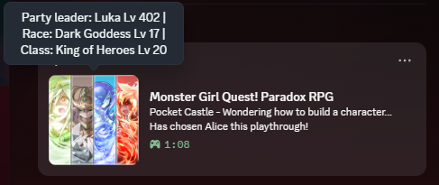

# Monster Girl Quest! Paradox RPG – Discord Rich Presence

Shows what you're doing in **Monster Girl Quest! Paradox RPG** on your Discord profile: where you are, what you're up to, and rotating trivia about your playthrough.



**[Download the latest release](https://github.com/Pauliinchen/MGQ-Paradox-Discord-Rich-Presence/releases/latest)**

## Features

| Where you are | What Discord shows |
|---|---|
| Anywhere | `<Location> - Exploring . . .` / `In combat!` / `In menu . . .` |
| World map | `Traveling the world - On foot . . .` / `Sailing . . .` / `Flying . . .` |
| Pocket Castle | `Pocket Castle - Currently in crafting hell...` and other rotating lines |
| No button pressed for a minute | `<Location> - Idle . . .`, except in battles, the Pocket Castle and the Labyrinth of Chaos |
| Labyrinth of Chaos | `Labyrinth of Chaos <Normal/Carnage> (<Biome>) - Floor <X> \| <Y> Rare Points!` |

**Hover the picture** to see your party leader: `Party leader: <Name> Lv <X> | Race: <Race> Lv <Y> | Class: <Job> Lv <Z>`

**Trivia** rotates every 16 seconds:

- Battles fought, enemies defeated, escapes and wipeouts
- Difficulty and playtime, each with a comment
- The biggest hit dealt, shortened like in the game (`118.497Qnt.`)
- Who in your party has the highest stat, and who has mastered the most jobs and races
- The last item you used, and on whom
- The music that's playing, named like in Kagetsumugi's jukebox
- Gold carried and spent, items synthesized, companions recruited, your Ilias or Alice choice, the deepest Labyrinth of Chaos floor, and more

Every number belongs to the save you're playing. See [Per-save statistics](#per-save-statistics).

**NSFW** lines only show when you turn them on, see [Options](#options).

Every line, its exact text, when it shows and the release that added it: [Activities](docs/Activities.md).

## Requirements

- Windows 10 or 11. Linux and Steam Deck (Wine) are untested.
- Monster Girl Quest! Paradox RPG with the **English translation** installed (the `Patch` folder must exist).
- The community's **mod loader**: the `Patch.rb` from [*Patch.rb (enable Type 1 mods)*](https://mgq.miraheze.org/wiki/Paradox_mods#Patch.rb_(enable_Type_1_mods)) on the MGQ wiki, put into the `Patch` folder. If you already use other Patch folder mods, you have it.
- The Discord **desktop app**, with *Settings → Activity Privacy → Share your detected activities* turned on.

Nothing else needs to be installed.

## Installation

1. Download `MGQ-Paradox-Discord-RPC-x.y.z.zip` from the [latest release](https://github.com/Pauliinchen/MGQ-Paradox-Discord-Rich-Presence/releases/latest).
2. Close the game and extract the zip **into your game folder**, the one that contains `Game.exe`:
   ```
   Game.exe
   Discord\                 <- new
   Patch\Discord_RPC.rb     <- new
   ...
   ```
3. Start the game as usual.

**Updating** works the same way: close the game and extract the new zip over the old one.

### Options

The mod adds **`[Discord] NSFW`** to the game's options: in the community's Mod Config Menu (`Patch\0_ModConfigMenu.rb`) when you have it installed, in the game's own Config menu otherwise.

- **Off** (default): Discord shows nothing NSFW.
- **On**: Discord shows the NSFW activities.

The option is the same for every save. It is kept as `nsfw = 0/1` in `Discord\Settings.ini`, not in your save files, so updating the mod resets it to off.

### After updating the translation

A translation update replaces `Patch\Patch.rb` and with it the mod loader, so no Patch folder mod is loaded any more. The game keeps working, but your Discord status stops showing. Put the community's `Patch.rb` back into the `Patch` folder.

### Uninstall

Close the game, double-click **`Discord\Uninstall.exe`** and choose **Yes**. It deletes `Patch\Discord_RPC.rb`, so the mod loader no longer loads the mod; the loader itself stays for your other mods. Then delete the `Discord` folder.

Deleting `Patch\Discord_RPC.rb` and the `Discord` folder by hand does the same.

> [!NOTE]
> Windows may warn that it protected your PC, because the uninstaller is not signed. Click **More info → Run anyway**. Its source code is in this repository.

## What it changes

The mod is a regular **Patch folder mod** ("Type 1"), `Patch\Discord_RPC.rb`, like the community's mods on the [MGQ wiki](https://mgq.miraheze.org/wiki/Paradox_mods). The community's mod loader runs it, and it works next to the other mods.

- **Nothing outside its own files**, `Discord\` and `Patch\Discord_RPC.rb`, is changed. `Patch\Patch.rb` is never touched.
- **Uninstalling** deletes `Patch\Discord_RPC.rb`. The mod loader stays for your other mods.
- If you delete the `Discord` folder without uninstalling, the game still starts normally, and the mod simply does nothing.
- **Your save files are never changed**, and they load the same with or without the mod.

## Per-save statistics

The trivia comes from two places:

| Read from your save | Counted by the mod |
|---|---|
| Battles fought, gold carried, playtime, difficulty, companions recruited, deepest Labyrinth of Chaos floor, your Ilias or Alice choice, top stat, mastered jobs and races | Enemies defeated, escapes, wipeouts, items synthesized, gold spent in shops, biggest hit |
| Covers your **whole playthrough** and shows up right away, even on old saves. | Covers only the time **since you installed the mod**. |

The game counts the second group only **across all saves combined**. To show them per playthrough, the mod counts the same events again for each save:

- **When counting starts:** from the first time you save with the mod installed. Until then, these counters are 0, and a line stays hidden until it has counted something. Earlier numbers can't be recovered.
- **Where they're stored:** in `Discord\Stats\`, one small file per save slot plus one for the autosave. Never inside the save file itself.
- **Copied or replaced saves:** each stats file is tied to one exact save. A save replaced or copied outside the game starts over at 0.
- **The game's backup save** (`SaveBackup.rvdata2`) isn't tracked. Loading it starts these counters at 0.

## Troubleshooting

- **Nothing shows on Discord:** make sure the mod loader is installed and activity sharing is turned on (see [Requirements](#requirements)). Discord can be started before or after the game; the status appears within about 15 seconds. If it still doesn't, check `Discord\DiscordPresence.log`.
- **The status updates slowly:** Discord allows 5 updates per 20 seconds, so a new map or fight shows up within about 4 seconds. The game also pauses while its window is in the background, so the status doesn't change then.
- **`Discord\InGame.log` exists:** it only appears when something went wrong inside the game. Please attach it when [opening an issue](https://github.com/Pauliinchen/MGQ-Paradox-Discord-Rich-Presence/issues).

## Building from source

Publishing a release on GitHub builds the mod and attaches the zip automatically.

To build locally, you need the .NET 10 SDK and the Visual Studio workload *Desktop development with C++*:

```powershell
dotnet publish MGQParadox.DiscordPresence -c Release
```

This puts the finished mod into the `Shipping` folder: copy its content into your game folder, as in the [installation](#installation). It also zips it. See [docs/DEVELOPER.md](docs/DEVELOPER.md) for the code layout, how the mod hooks into the game, and which game data it reads.

## Credits

- The mod loader this mod runs in is the community's `Patch.rb` from the [MGQ wiki](https://mgq.miraheze.org/wiki/Paradox_mods#Patch.rb_(enable_Type_1_mods)). It isn't part of this repository or its releases; please download it from there.

## Disclaimer

This is an unofficial fan project. It is not affiliated with Torotoro Resistance, the creators of Monster Girl Quest, or the English translation team. It contains no game or translation files.
